# recording.mp4 — annotated review

_Duration: 06:30 · Source: /home/dan/feedback-drop/canopy/inbox/2026-06-12_13-09-45/recording.mp4_

_Transcript: whisper · en (p=1.00) · Frames: 70/77 segments · Generated: 2026-06-12 08:13:06_

---

## [00:01] segment 0001

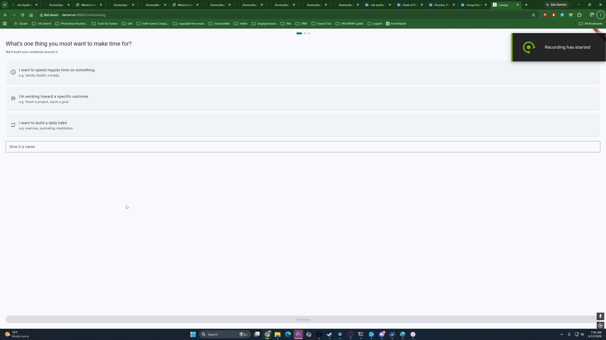

> Hey, Claude on Dan server. It's Dan. Let's go through

---

## [00:08] segment 0002

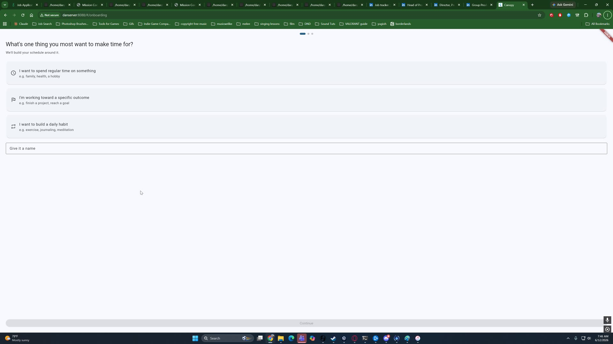

> Canopies together

---

## [00:09] segment 0003

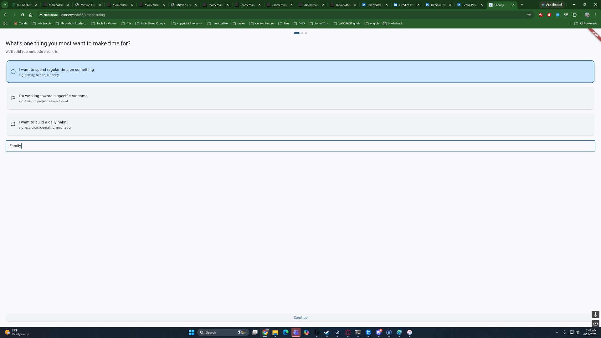

> So I think this part is fine. It's a family. I say continue. I'm good to go

---

## [00:17] segment 0004

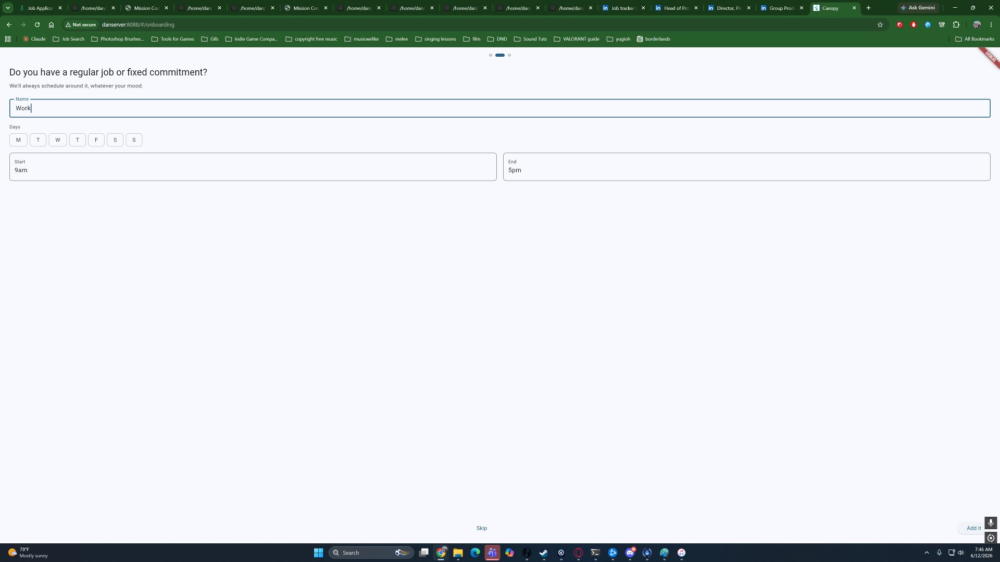

> Yep work

---

## [00:19] segment 0005

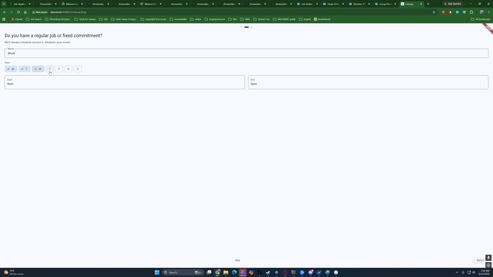

> Monday Tuesday Wednesday Thursday Friday. I

---

## [00:23] segment 0006

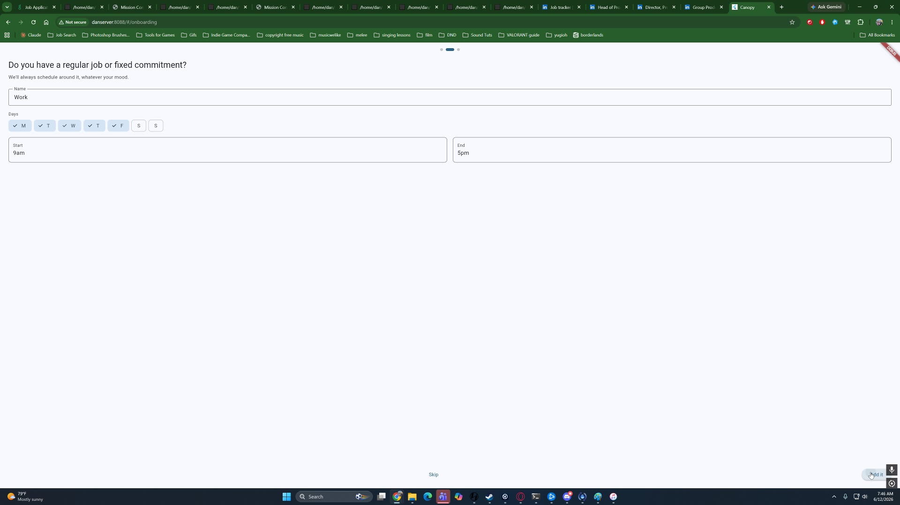

> Want to add it good?

---

## [00:28] segment 0007

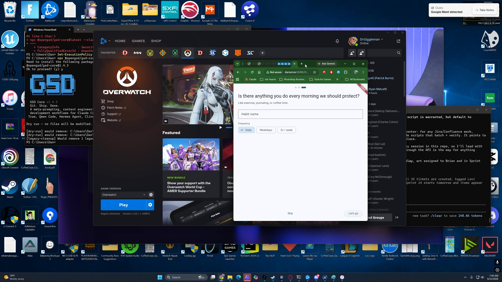

> I

---

## [00:29] segment 0008

> Have it name would just say vibe coding

---

## [00:37] segment 0009

> Let's go

---

## [00:39] segment 0010

> Then it takes me immediately to my goals. It's funny when I did this the first time it it actually didn't

---

## [01:01] segment 0011

> There was a there was feedback I had but I didn't get it again. Let me try

---

## [01:05] segment 0012

> How does this happen?

---

## [01:07] segment 0013

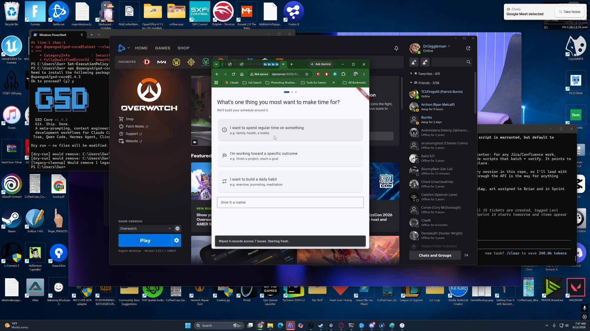

> Okay, I want to spend regular time on something

---

## [01:12] segment 0014

> Towards a specific outcome. Was it any no those are all the same. Okay. Give it a name family

---

## [01:17] segment 0015

> continue

---

## [01:20] segment 0016

> Name work

---

## [01:23] segment 0017

> When did you say Wednesday Thursday Friday?

---

## [01:27] segment 0018

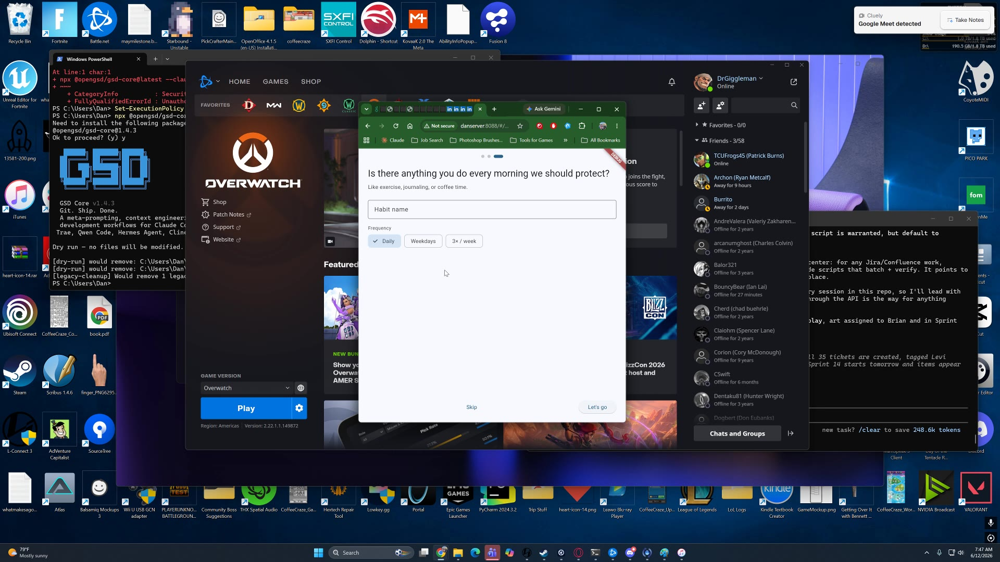

> At it

---

## [01:31] segment 0019

> I don't know what the feedback was so this is all fine. We'll just say vibe coding again

---

## [01:37] segment 0020

> And I'll say weekdays. Let's go so it goes to the goals page to me. I don't know about this goals page

---

## [01:48] segment 0021

> I feel like

---

## [01:51] segment 0022

> These two slashes there means you would drag them around and maybe that's what it does on we had some more habits

---

## [01:58] segment 0023

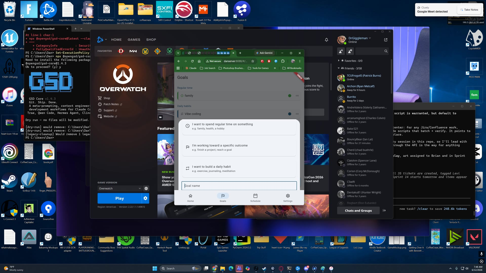

> build habit cleaning

---

## [02:01] segment 0024

> About habit clean. Oh

---

## [02:04] segment 0025

> sessions per week seven with priority. Oh

---

## [02:09] segment 0026

> Well, okay, so first of all this UI comes up

---

## [02:13] segment 0027

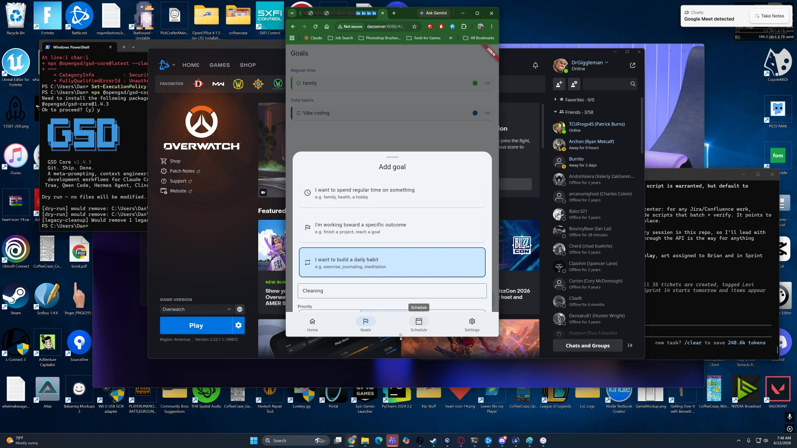

> Like this. Let's see what it's like. It's taller. Yeah, this this just isn't this UI isn't gonna work

---

## [02:23] segment 0028

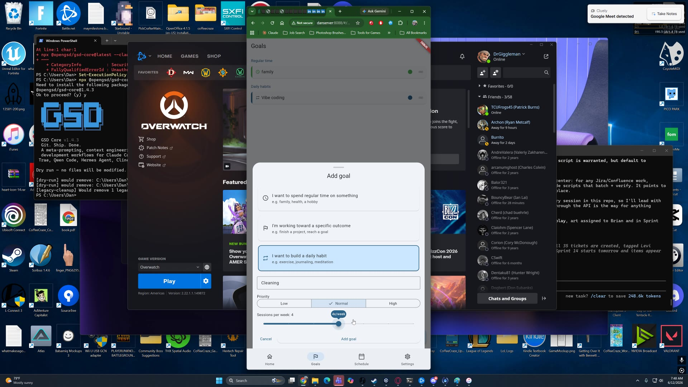

> Because you got a scroll like this. So that's not good. So we should rethink the UI on this on this thing

---

## [02:29] segment 0029

> That I'm showing right now

---

## [02:31] segment 0030

> But say priority low normal high

---

## [02:36] segment 0031

> And then I guess you can switch the priority like this if I drag and drop

---

## [02:40] segment 0032

> No, it looks like there's no drag and drop. So

---

## [02:45] segment 0033

> What this page is supposed to be it's not clear if it's a prioritization, which I think is fine

---

## [02:50] segment 0034

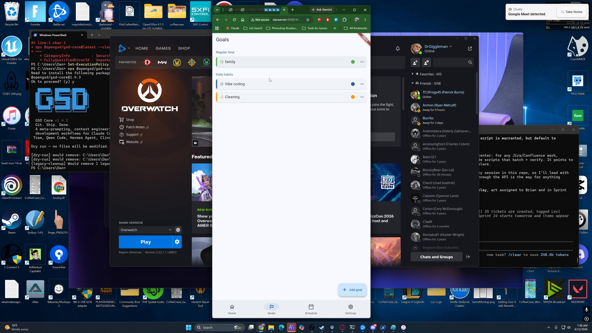

> Which is good. It should make it clear that it's a prioritization

---

## [02:53] segment 0035

> Page

---

## [02:55] segment 0036

> And then I click each one and I can set the priority. Let's do high say

---

## [03:00] segment 0037

> Yeah, cuz

---

## [03:02] segment 0038

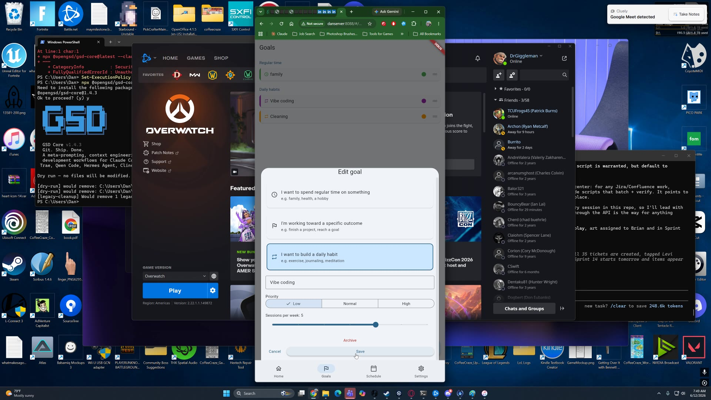

> Making it high made it purple. I guess what about making it low say no, it doesn't so the colors are changing

---

## [03:08] segment 0039

> It's not making a ton of sense to me about that

---

## [03:14] segment 0040

> So in general, I think this page isn't doing what it's supposed to do which is like

---

## [03:21] segment 0041

> You know, tell me what my goals are and how focused I am on there and the priorities, whatever

---

## [03:26] segment 0042

> But I also don't necessarily know that should be the landing page. I feel like home should be the landing page

---

## [03:31] segment 0043

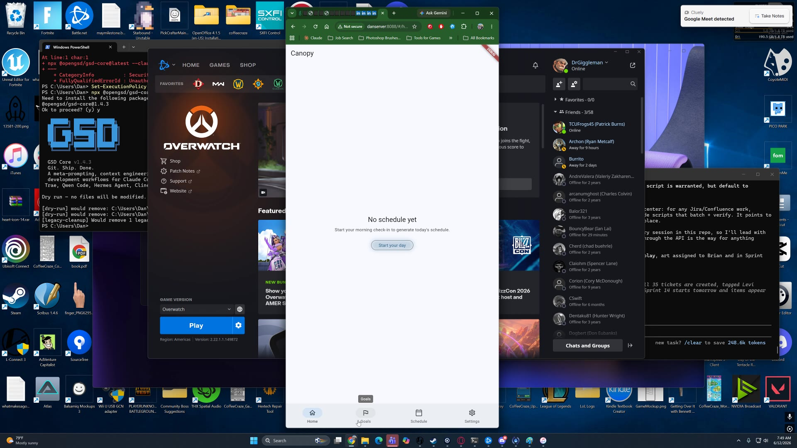

> You know what I mean?

---

## [03:34] segment 0044

> So that's that

---

## [03:40] segment 0045

> Now I press start my day now I click this

---

## [03:45] segment 0046

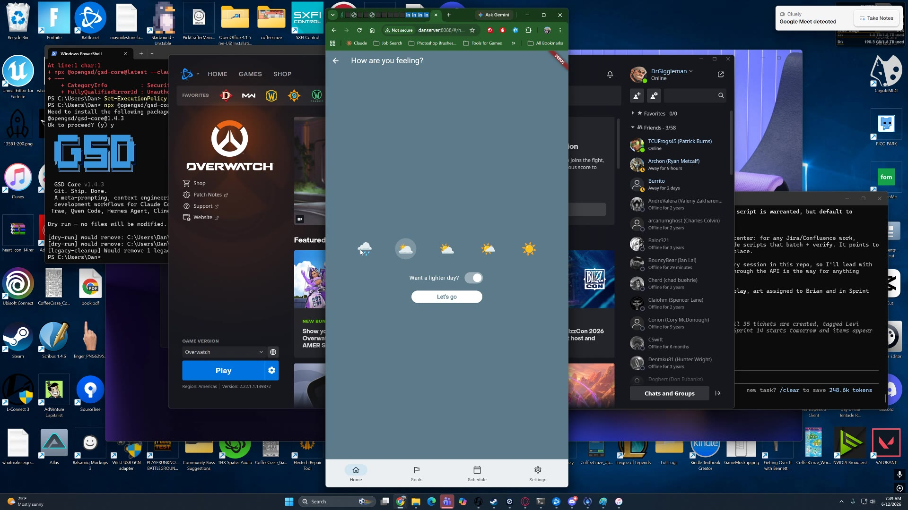

> There's no hover over effects

---

## [03:47] segment 0047

> This yellow is really hard to read so that yellow should be less hard to read

---

## [03:54] segment 0048

> but

---

## [03:56] segment 0049

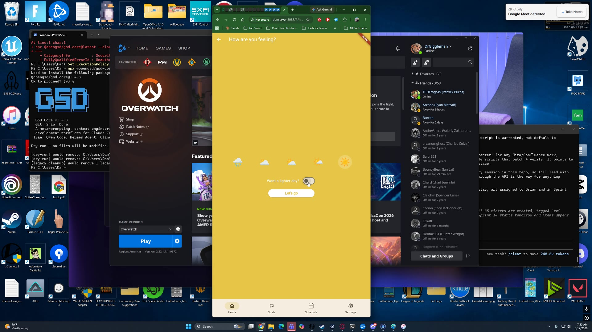

> No matter what I click it gives me this one a lighter day thing and in addition I

---

## [04:02] segment 0050

> Can't I

---

## [04:04] segment 0051

> Can't tell if it's on or off this button is not clear to me. It doesn't look like if it's on or off to me

---

## [04:15] segment 0052

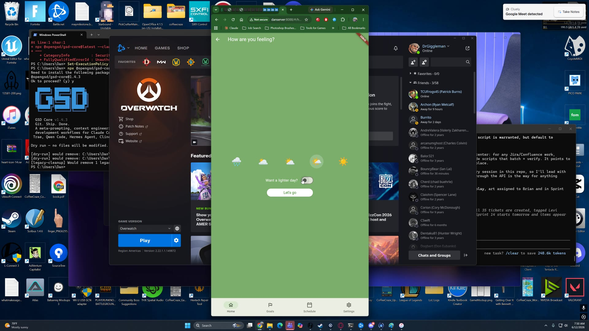

> So personally I would put the one or lighter lighter day

---

## [04:23] segment 0053

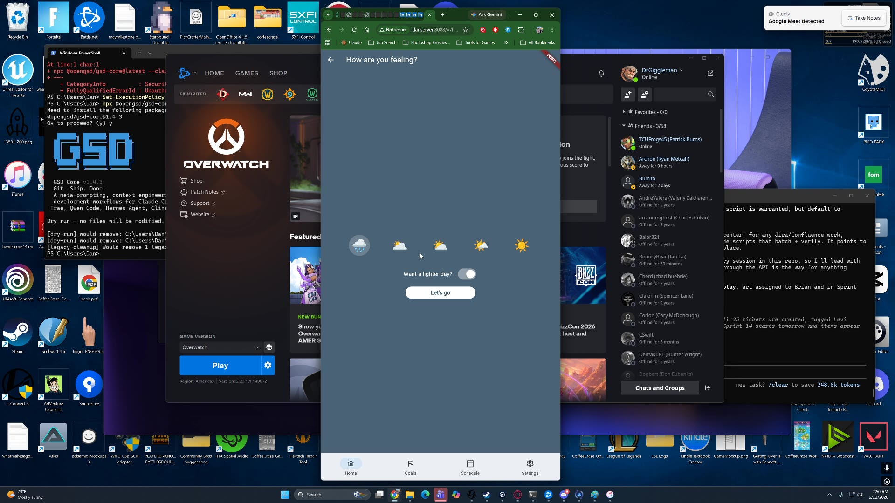

> After if you click, you know, like sat one of the Saturdays

---

## [04:29] segment 0054

> And you say let's go then it asks you do you want to push forward or do you want a lighter day?

---

## [04:35] segment 0055

> You say, let's go. Anyways, I'll do that

---

## [04:39] segment 0056

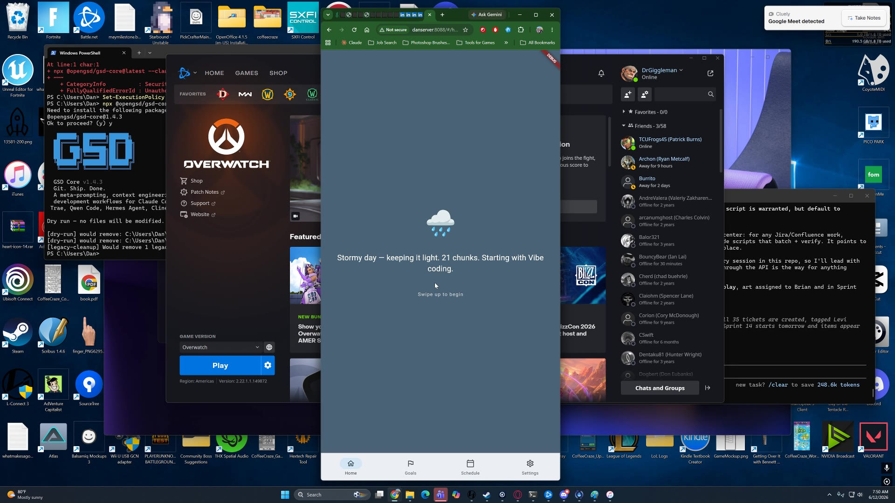

> So I'm gonna keep it at like 21 shrunk chunks

---

## [04:44] segment 0057

> Starting with vibe coding

---

## [04:46] segment 0058

> So vibe coding and then it takes me home, right? It tells me up next this home page after this is started

---

## [04:56] segment 0059

> To me, I don't know why this shouldn't look like the schedule. I just clicked to it

---

## [05:01] segment 0060

> The schedule is is the thing I care about at this point. I think and

---

## [05:05] segment 0061

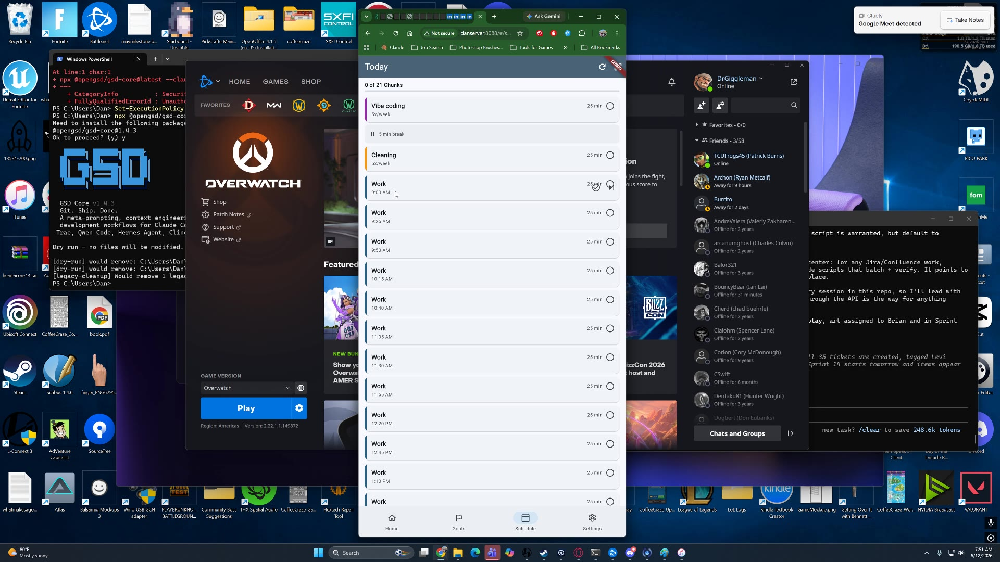

> And the time itself and when I look at this I see I see 5x a week instead of the time that I'm supposed to be doing it

---

## [05:15] segment 0062

> I want to know the current time

---

## [05:18] segment 0063

> What I'm doing when it ends how long blah blah blah what's

---

## [05:23] segment 0064

> What like instead of up next what am I doing right now?

---

## [05:27] segment 0065

> What's the next thing what time is it what time am I done, right?

---

## [05:30] segment 0066

> Like this this thing does not tell me what I'm supposed to be doing

---

## [05:34] segment 0067

> and then over here like

---

## [05:38] segment 0068

> There should be like something I'm done or skip or something right? That's that's home

---

## [05:42] segment 0069

> So for the schedule itself and I don't know that the home schedule are separate pages necessarily maybe they are but I don't know

---

## [05:50] segment 0070

> That's that's worth a debate, but

---

## [05:53] segment 0071

> With these there's a mark complete button and a skip

---

## [05:57] segment 0072

> But there's a little circle next to it. So that's like a really unclear UI for a human

---

## [06:03] segment 0073

> And so yeah, so I think the basics just aren't

---

## [06:12] segment 0074

> Here yet, so I think we need to we need to we need to address all these things

---

## [06:20] segment 0075

> Pretty decisively pretty heads on so I think I think we still need quite a bit of rework on just the basics of the UI

---

## [06:25] segment 0076

> So that's my feedback

---

## [06:28] segment 0077

> Thank You co-op

---
