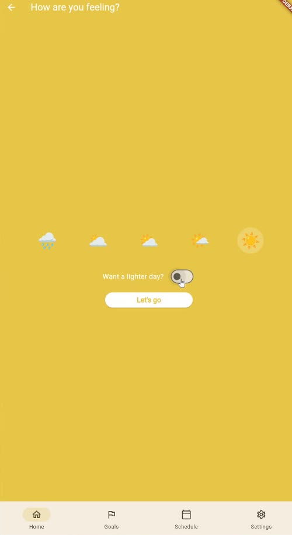
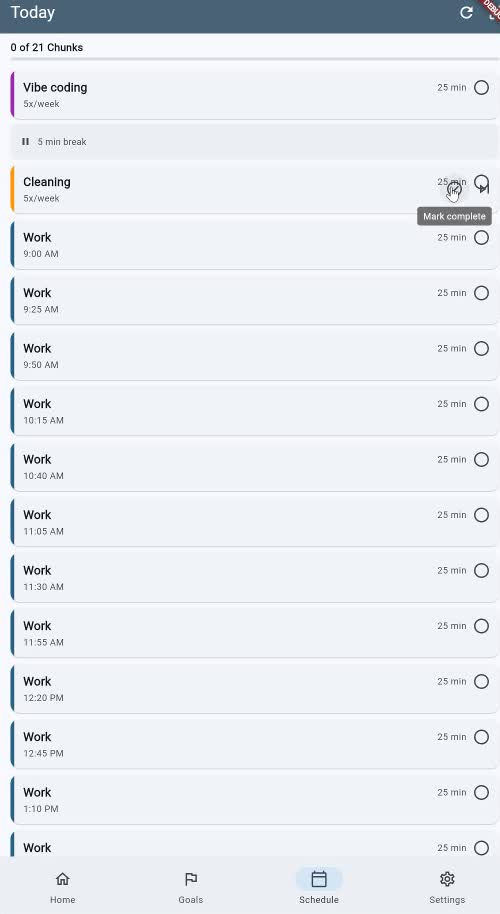

# Canopy

**A time-budgeting app that builds your day around your goals — and around how you actually feel.**

Most planners assume every day is the same day. Canopy doesn't. You check in each morning with
your mood, and that shapes how demanding the generated schedule is. Time is allocated in 25-minute
focused **Chunks** across your goals, fixed commitments are always honored regardless of mood, and
every quarter the app shows you where your time really went versus where you said it should go.

<p align="center">
  
  &nbsp;&nbsp;
  
</p>

## Why it's rule-based

There is no LLM in the scheduling engine, on purpose. A schedule you can't predict is a schedule
you won't trust — and trust is the whole product. Every allocation decision is deterministic and
unit-tested, so the same goals and the same mood always produce the same day, and a surprising
schedule is a bug rather than a mystery.

## How it works

- **Three goal types.** Time-target (budget N hours/week), outcome (a thing to finish), and habit
  (do it N times/week). Each carries a priority weight that measurably drives how many Chunks it gets.
- **Mood-adaptive capacity.** The morning check-in sets a cap on discretionary Chunks. Low days get
  a restorative floor; high days reserve a slot for high-priority or energy-giving work.
- **Energy valence.** Each goal is tagged as giving, neutral, or costing energy, and the engine
  schedules around that rather than treating every hour as interchangeable.
- **Fixed commitments** are placed first and never dropped, whatever the mood.
- **Honest streaks.** Streaks are computed at generation time from real completion data — the app
  will not flatter you.
- **Breaks** are scheduled, not assumed: 5 minutes short, 25 minutes long every 3–4 Chunks.
- **Quarterly review.** A data summary plus guided reflection on planned-versus-actual.

## Stack

Flutter / Dart, targeting mobile and desktop. Local-first persistence with Hive (`hive_ce`),
`go_router` for navigation, `provider` for state, `fl_chart` for the review visuals, and
`flutter_local_notifications` + `timezone` for Chunk reminders. No backend, no account, no
telemetry — your schedule stays on your device.

Roughly 14k lines of app code in `lib/`, covered by a 340-test suite.

## Running it

```sh
flutter pub get
flutter run          # add -d chrome, -d linux, -d macos, etc. to pick a target
flutter test         # 340 tests
flutter analyze      # clean
```

## Status

Shipped through **v1.4 "Energy-Aware."** Working and dogfooded daily. Development history,
milestone records, and requirement tracking live in [`.planning/`](.planning/) — this project is
built with [GSD](https://github.com/open-gsd/gsd-core), so the full planning trail is in the repo
alongside the code.

## License

Personal project, shared as a work sample. Ask before reusing.
